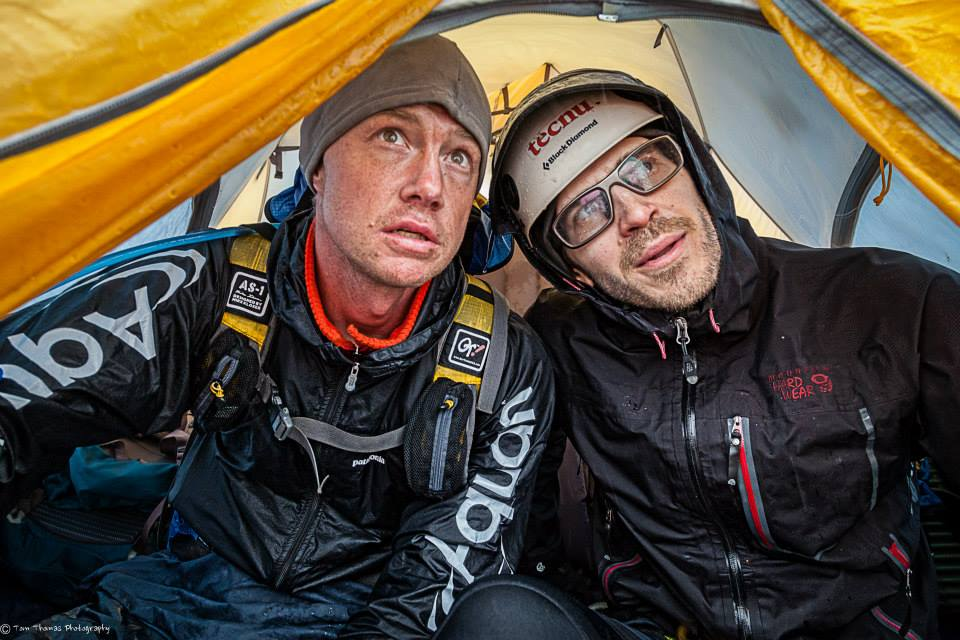

Every year I get excited about the Gold Rush Mother Lode race…I find myself “needing” to do it. After a tough full start to 2013 wherein I kept a full time job, graduated an intense 3mo entrepreneurship program, got engaged, and got married (City Hall!!!)…I managed to fall out of shape a bit. I couldn’t commit to being a part of Team Tecnu anymore, so I toned down my AR. But…I need my adventure fix, so in the last 6wks leading up to this race, scrambled together a team that fluctuated team members repeatedly. When the dust settled, I showed up for the 2013 installment with two new teammates, Mike DeFillipo, and Dennis Wilkinson. I wanted to take it a little easier this year, and we talked about our goals for the race being to finish, and have fun. Both Mike and Dennis had a fair amount of shorter race experience, but had yet to complete a multi-day race. I would try to lead them to the finish.

The race once again started with a fairly long paddle with a short trek in the middle of it. That was followed by a bike leg, and then a very long trek leg that was difficult to plan for. This massive trek leg started on day 2, and we estimated would take us about 40h to complete (with a ropes course near the 3/4 mark). Our strategy was very conservative, with me calling for sleeps both of the first two nights (3h each night). It was an interesting strategy that kept us in the midpack, looking very refreshed. As we came into TA’s and saw other teams, we looked fairly fresh in comparison. But…during our long trek, the weather took a massive turn for the worse, and we found ourselves exposed on a ropes course without the proper rain gear. It rained, it hailed, the wind blew, and we began to freeze. At this point, we made the decision to abandon the course, and our race….a tough decision, but one we stand by. All of the teams in the midpack we were competing with made the same decision, after also not packing their rain gear on what was a very long section.

It would have been interesting to race that last day…as we had the potential to push through the night without sleep and leapfrog some teams. Instead, we learned a lot of valuable lessons on being prepared, and on when not to risk too much.