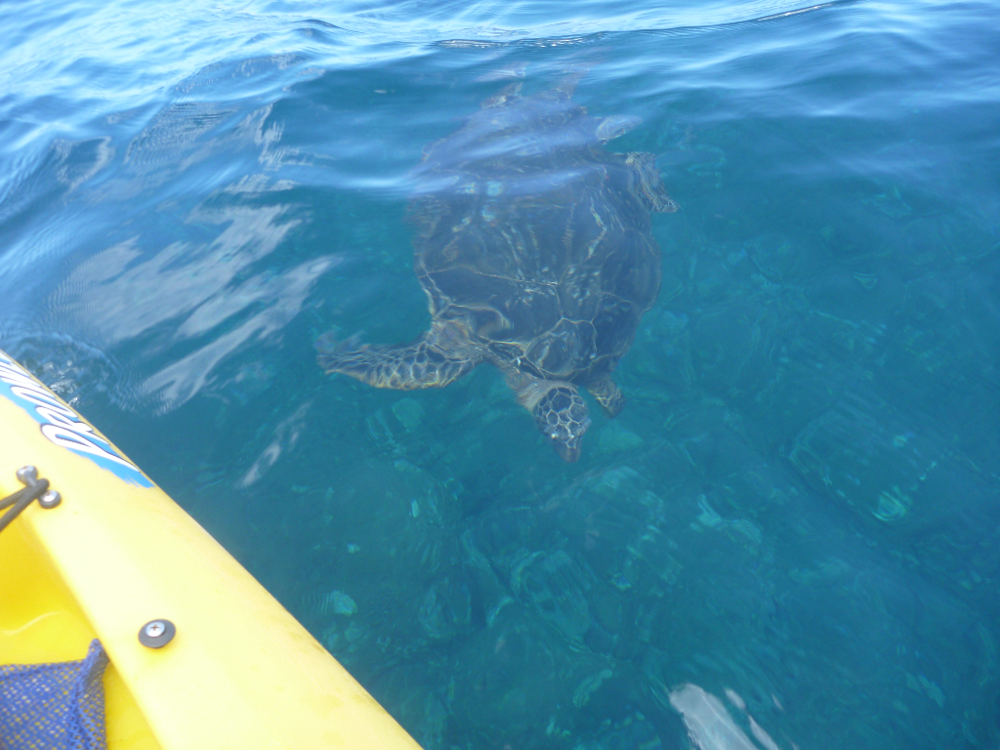
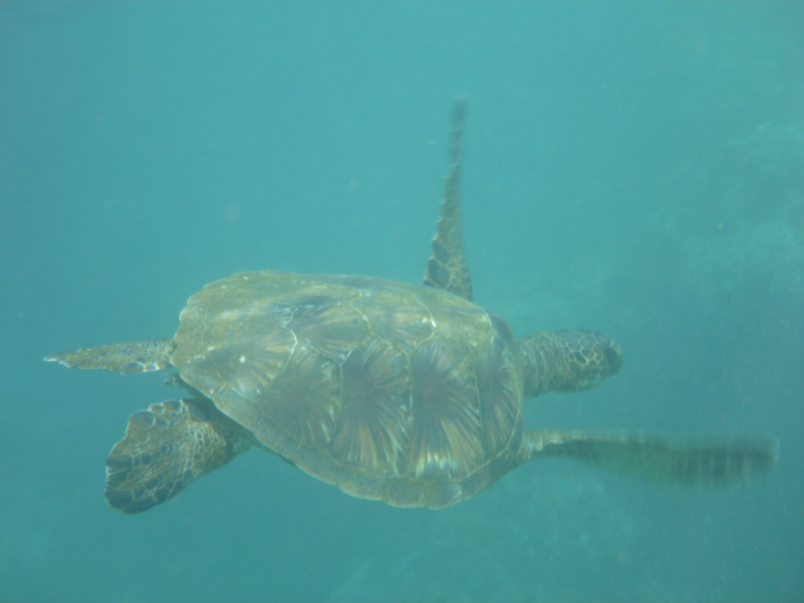
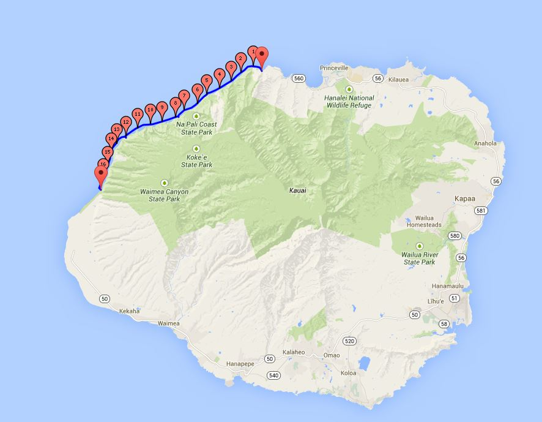

During the summer of 2011, my good friend Adam talked a sea kayak rental place on Kau’ai into letting us (Adam, Janet &amp; I) rent two kayaks all on our own for two days to kayak the famous Na’pali coast. We all had kayaked in the ocean before, though this would be at a new level for me. It was an amazing trip, full of interesting sea caves, crystal clear water, sunny skies, big swells, rough beach landings, surfing with dolphins, snorkeling with sea turtles, and observing the completely non-illusive naked hippie. We stopped halfway on the first day to camp at Milolii Beach, only accessible by ocean. In total, we covered a little over 16mi, and made three beach landings (no small feat!). The trip started out rough, with a relatively large 6-7ft swell, but then calmed down on our second day. It was a very memorable trip!

Map of our trip:

