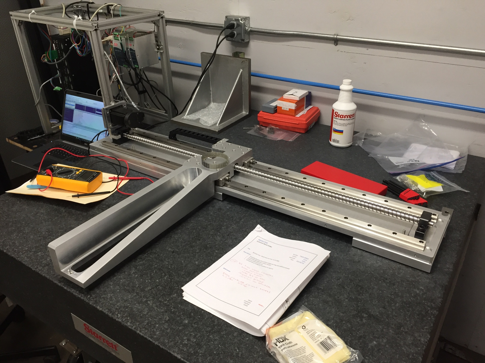

##Project Goals:
* travel up to 400mm/s
* exchangeable & adjustable recoater blades
* running parallelism of ~5micron over 350mm diameter of build plate
* minimize length of axis, while obtaining required minimum travel of XXmm
* vacuum compatability desired, as would pass through a vacuum, wouldn't operate in a vacuum
* ability to reliably and repeatably spread out 20micron thick metal powder layers

I initially explored using an off the shelf stage, so looked at the usual suspects (THK, Misumi, NSK, Thomson, etc...). It became apparent fairly early on that none of the off the shelf stages would meet all of our requirements. The biggest challenge was getting a low running parallelism over our build area, a spec we cared about immensely, as we are trying to spread out 20micron thick layers of metal powder. Off the shelf solutions could achieve about a 50micron running parallelism, whereas if we used THK LM Linear Bearings we could achieve at best a 1.5micron running parallelism (if we went with Ultra precision grade rails). The advantage of building our own axis was also that we could try different rail precisions, so could start with a High Accuracy grade giving us a running parallelism of 5 microns. At a later date we could always improve on that.

With that background knowledge, I worked to design a custom axis, creating a large spreadsheet to appropriately select the properly sized motor (matching motor inertia to load inertia, validating required speeds and accelerations with estimated loading), as well as properly sized linear bearings and ballscrew.

I did extensive FEA to ensure the recoater axis would be stiff enough during recoating operations, with simulated point loads. I also ran resonance studies to understand at what operation frequencies (speeds) we would see any resonance in the recoater axis beam.

The axis was built after I no longer worked at Matterfab, but was successfully integrated and run on their second generation metal 3D printer.

##Tools used:
- Autodesk Inventor
- Excel
