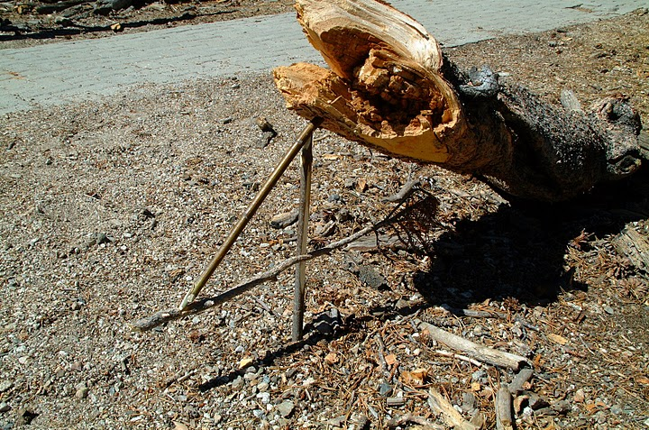

Before setting out on my through hike of the John Muir Trail, I decided it would be fun to take a Wilderness Survival Course. I signed up for a 5 day course with [SWS Mountain Guides](http://www.swsmtns.com/ "SWS Mountain Guides") in Golden Trout Wilderness, just South of Mt Whitney in the Eastern Sierras of California.

It was a pretty interesting and fun 5 days of learning how to find water, identify edible plants, administer wilderness first aid, create tools from stone/wood, create animal traps (fish, game), navigate using a compass and map, build safe shelters, and start fires multiple ways. One of the highlights of the training was actually catching a golden trout with my bare hands!!

The last night of this training I spent solo in the wilderness. I had been solo in the wilderness before, something I’ve always found challenging. This particular experience was one for the books. I messed up on my bear hang, got rattled, and decided (through poor judgement) to just hike out. I proceeded to climb a mountain off trail in hopes of finding a cross cutting major trail at dusk, in failing light. After getting horribly lost, I continued to soldier on, several hours later finally figuring out where I was….miles from where I thought I was heading. It was an interesting night…filled with invaluable lessons that have helped me in my adventure racing navigation/decision making.