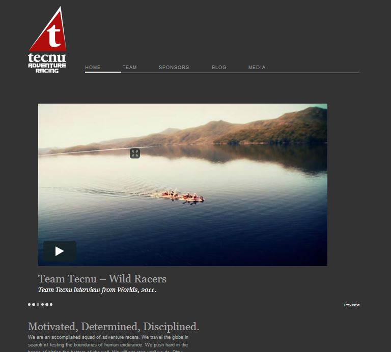

In 2012 I learned how to create some basic websites using WordPress. In the process, I learned a bit about html, css, UI design, and database management. It was a fun endeavour! I started with creating a simple website to summarize my personal, and professional portfolio (what you’re looking at right now!). I then used the skills I learned to create a new website for my adventure racing team, Team Tecnu (the website no longer exists).

In 2014, I began using Squarespace to create websites quickly, helping out friends and my wife with websites for their businesses. I became the webmaster for [Nav-X Challenge](http://www.navxchallenge.com/), and created a website for a business of my own, [Areni Motion](http://www.arenimotion.com).

This past year (2016) I’ve been learning how to create websites from scratch using React (a javascript library to build web-apps pioneered by facebook). I’m hoping to have something to show off in 2017…to prove I actually learned something 😉

Tools used:

- WordPress
- Squarespace
- Atom Editor
- Sketch